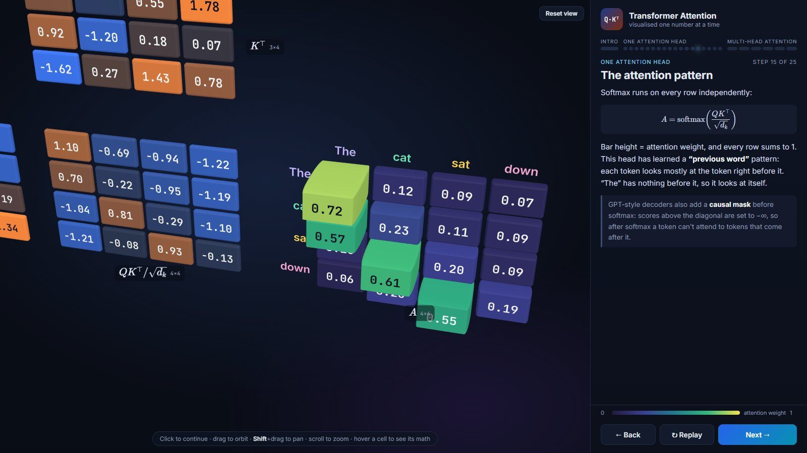

# Transformer Attention, Visualized

[](https://transformer-visualized.vercel.app)
[](LICENSE)
[](#contributing)
[](https://github.com/rodonguyen/transformer-visualized/stargazers)
[](https://threejs.org/)
[](https://vite.dev/)
[](https://gsap.com/)

An interactive 3D walkthrough of a Transformer **attention head** and **multi-head attention**, built with three.js. Every number is on screen, and you can check each one by hand.

**Live demo: https://transformer-visualized.vercel.app**



$$\mathrm{Attention}(Q,K,V) = \mathrm{softmax}\left(\frac{QK^{\top}}{\sqrt{d_k}}\right)V$$

## What it shows

A toy sentence, **“The cat sat down”**, goes through the attention formula in 25 click-through steps.
The sizes are small enough to show every value: n = 4 tokens, d<sub>model</sub> = 6, h = 2 heads, d<sub>k</sub> = 3.

**One attention head (steps 2–19)**

- Tokens become the embedding matrix X (4×6).
- The projections Q = XW<sup>Q</sup>, K = XW<sup>K</sup>, V = XW<sup>V</sup>. One entry is worked out term by term: pair up the numbers, multiply, add.
- The scores S = QK<sup>⊤</sup>, with one query–key dot product worked out in full.
- Scaling by √d<sub>k</sub>, then softmax in two parts (exponentiate, normalise), shown on one row.
- The attention pattern A as 3D bars. Head 1 has learned to look at the *previous word*.
- The weighted sum of values Z = AV, built up for one token.

**Multi-head attention (steps 20–25)**

- A second head with its own weights runs on the same X. It has learned to look at the *subject*, “cat”.
- The two attention patterns side by side.
- Concat(Z<sub>1</sub>, Z<sub>2</sub>) and the output projection W<sup>O</sup>.
- The complete formula, and how the toy sizes compare with GPT-2 small.

Every intermediate result is rounded to 2 decimals, and the next stage is computed from the rounded values. So any number on screen can be reproduced from the numbers shown before it. Hover any cell to see its formula with the real numbers filled in, and the row and column it came from are highlighted.

### Reading the colours

| | Meaning |
| --- | --- |
| Blue → grey → orange | Negative → zero → positive values |
| Dark purple → yellow | Attention weights from 0 to 1 |
| Yellow / cyan outline | The row and column being multiplied |
| White outline | The cell being computed |
| `?` cell | Not computed yet |

## Controls

| Action | Input |
| --- | --- |
| Next step | Click the scene, <kbd>→</kbd>, <kbd>Space</kbd>, <kbd>Enter</kbd>, or **Next** |
| Previous step | <kbd>←</kbd>, <kbd>Backspace</kbd>, or **Back** |
| First / last step | <kbd>Home</kbd> / <kbd>End</kbd> |
| Replay the current step | <kbd>R</kbd> or **Replay** |
| Orbit / pan / zoom | Drag / <kbd>Shift</kbd> + drag (or right-drag) / scroll |
| Re-frame the camera | <kbd>C</kbd> or **Reset view** |
| Inspect a value | Hover a cell |
| Jump to a step | Click the progress bar, or open a link such as `/#12` |

## Run locally

Requires [Node.js](https://nodejs.org/) 20.19+ or 22.12+, and a browser with WebGL.

```bash
npm install
npm run dev       # http://localhost:5173
npm run build     # production build in dist/
npm run preview   # serve the production build locally
```

## Project structure

```text
index.html        page shell: 3D viewport + side panel
src/
  main.js         entry point: step navigation, click and hover handling
  data.js         the toy example: tokens, embeddings X, weights per head, Wᴼ
  model.js        computes every intermediate (Q, K, V, scores, softmax, A, Z, output)
  steps.js        the 25 steps: panel text (HTML + KaTeX) and one animation per step
  fx.js           reusable animations: fly, fill, dot product, softmax, weighted sum
  scene.js        creates every matrix and its hover explanation
  matrix.js       3D building blocks: matrices of numbered cells, chips, glyphs, token tiles
  layout.js       positions of matrices and scratch areas, camera directions
  stage.js        renderer, camera, orbit controls, camera framing
  ui.js           side panel, progress bar, keyboard shortcuts, tooltip
  colors.js       colour scales shared by the scene and the panel
  text.js         3D text and number formatting
  html.js         KaTeX helpers and coloured number tables
  style.css
docs/
  architecture.md how the code fits together, and how to add a step
  deployment.md   building, hosting, and publishing
```

## Changing the example

You can edit the sentence, embeddings and weights in [`src/data.js`](src/data.js), and every value after them is recomputed by [`src/model.js`](src/model.js).
Some things are fixed, though:

- The sizes (4 tokens, d<sub>model</sub> = 6, 2 heads of size 3) are built into the layout and parts of the text.
- The step text describes the patterns these particular weights produce.

So if you change the data, review [`src/steps.js`](src/steps.js) too. See [docs/architecture.md](docs/architecture.md) for how steps and animations are put together.

## Deploying

This is a static site: `npm run build` writes everything to `dist/`, and any static host can serve it. It is deployed on Vercel. See [docs/deployment.md](docs/deployment.md) for Vercel, Cloudflare Pages, Netlify and GitHub Pages.

## Built with

[three.js](https://threejs.org/) (WebGL, orbit controls, HTML labels) · [GSAP](https://gsap.com/) (step timelines) · [troika-three-text](https://github.com/protectwise/troika/tree/main/packages/troika-three-text) (sharp numbers in 3D) · [KaTeX](https://katex.org/) (formulas) · [Vite](https://vite.dev/) · [Fontsource](https://fontsource.org/) (Inter, JetBrains Mono)

## Contributing

Contributions are welcome: bug reports, clearer explanations, fixes, and new steps (for example a causal mask or positional encodings).

1. Open an [issue](https://github.com/rodonguyen/transformer-visualized/issues) to report a bug, or to discuss an idea before you start on something big.
2. Fork the repo, create a branch, then run `npm install` and `npm run dev`.
3. Make sure `npm run build` passes, and click through the steps you changed. The progress bar jumps straight to any step.
4. Open a pull request that explains what changed and why.

[docs/architecture.md](docs/architecture.md) explains how the scene, the steps and the animations fit together.

## License

[MIT](LICENSE)
