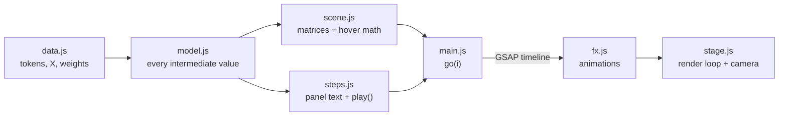

# Architecture

This is a static single-page app: plain ES modules, bundled by Vite, with no UI framework.
Every matrix needed for the whole tour is created once, when the page loads, in a single three.js scene, and starts out hidden.
A step never adds matrices to the scene. It only animates the state of existing objects (visibility, values, highlights, positions, bar heights) and moves the camera.
The temporary number tiles and operator text used for the working-out come from object pools.



## Data and math

- [`data.js`](../src/data.js) holds the toy example: `TOKENS`, the embeddings `X` (4×6), `WQ`/`WK`/`WV` (6×3) for each head, and `WO` (6×6).
  All of these values have one decimal. `FOCUS` is the token row followed through the detailed steps (“down”).
- [`model.js`](../src/model.js) computes, for each head: `Q, K, V, KT, S`, the scaled scores `Ss`, the softmax parts `soft` (`e`, `sum`, `w` per row), `A` and `Z`. After that it computes `CONCAT` and `OUT`.
  Each stage is rounded with `r2()`, and the next stage is computed from the rounded numbers. That's what makes every number on screen reproducible by hand.
- When the animations show individual products, they use up to 3 decimals (d<sub>1</sub> + d<sub>2</sub> decimals, capped at 3). That keeps the running totals visibly consistent.

## Scene objects

| Object | File | What it is |
| --- | --- | --- |
| `MatrixViz` | [`matrix.js`](../src/matrix.js) | A grid of `Cell`s (rounded box + 3D text), optional token labels on rows and columns, and an HTML label (KaTeX name + shape). |
| `Frame` | `matrix.js` | A glowing outline around a row, column or cell: `m.frame('row').row(i)`. The colours come from `PALETTE` in [`colors.js`](../src/colors.js). |
| `Chip`, `Glyph` | `matrix.js` | Free-floating number tiles and operator text (`×`, `+`, `=`) for the working-out, drawn from the pools `ctx.chips` / `ctx.glyphs`. |
| `TokenTile` | `matrix.js` | The word tiles in the intro. |

These are the properties the animations drive with GSAP:

- **Matrix:** `opacity`, `fade` (pushes a whole layer into the background), `labels` (row/column labels).
- **Cell:** `v` (value, which also sets the colour and text), `emph` (dims the cell), `bar` (extrusion used for attention weights), `pop` (scale), and `reveal(on)` (the `?` placeholder vs. the value).
- **Frame:** `opacity`.

[`scene.js`](../src/scene.js) creates every matrix. It returns `heads[0..1]` (`X, WQ, WK, WV, Q, K, V, Qc, KT, S, A, Vc, Z`) and `fin` (`A1cmp, A2cmp, Z1c, Z2c, CONCAT, WO, OUT`).
`Qc`, `KT` and `Vc` are separate copies placed around the product they feed, in the classic layout: the left operand to the left, the right operand above, the result below-right.
The animations fly them in from the originals.

The coordinates live in [`layout.js`](../src/layout.js):

- `P` holds the top-left corner of each matrix.
- `H2` is the offset of head 2's parallel sheet.
- `WS` holds the scratch areas where arithmetic is laid out.
- `DIR` holds the camera directions.

### Hover explanations

Every matrix can have `explain(i, j)`, which returns:

```js
{
  title: 'HTML',
  lines: ['KaTeX', '…'],         // the formula, then the same formula with the numbers substituted
  note: 'HTML',                  // optional
  sources: [[matrix, 'row' | 'col' | 'cell', a, b]], // highlighted while hovering
}
```

Whenever the pointer moves, `main.js` raycasts against the revealed, visible cells. It then shows the tooltip and highlights the cells listed in `sources`.

## Steps

Each entry in `STEPS` ([`steps.js`](../src/steps.js)) looks like this:

```js
{
  section: 1,                    // index into SECTIONS (Intro / One attention head / Multi-head attention)
  title: 'Scale by √dₖ',
  body: () => html,              // panel text; k()/K() render inline/display KaTeX, numTable() draws coloured tables
  legend: ['div', 'seq'],        // colour legends to show
  play(tl, c) { /* add tweens to the timeline */ },
}
```

`play()` builds a paused [GSAP timeline](https://gsap.com/docs/v3/GSAP/Timeline/). The `c` context has:

- `heads`, `fin`, `tokens`, `tags` and `all` (every matrix).
- `chips` / `glyphs` (object pools).
- `stage` (the renderer and camera).
- `c.view(tl, items, { dir, pad }, at)`, which queues a camera move framing some matrices (or `Box3`s) at time `at`.
- `c.detail`, for animations that span several steps. For example, `dpPick → dpMult → dpSum` share one dot product across steps 4–6.

The reusable animations live in [`fx.js`](../src/fx.js):

- Basics: `show`, `hide`, `fly`, `appear`, `reveal`, `dim`/`undim`, `bars`.
- Whole matrix products: `fill`.
- Moving copies into place: `flyCopy`, `flyTranspose`, and `scaleScores` for the √d<sub>k</sub> scaling.
- Worked arithmetic: `dpPick`/`dpMult`/`dpSum` (one dot product), `smExp`/`smNorm` (softmax of one row), `wsScale`/`wsSum` (weighted sum of values).

## Navigation

The `go(i)` function in [`main.js`](../src/main.js) works like this:

- **Moving to the next step:** the current timeline jumps to its end, and step `i` plays.
- **Any other jump** (going back, the progress bar, a `#N` link, or Replay): the scene is reset, and steps `0…i-1` are replayed instantly with `timeline.progress(1)`. Then step `i` plays.
  While this fast-forward runs, `c.instant` is `true`: camera moves are skipped, and only the last requested view is applied afterwards.

So any step can be reached directly, and the scene always matches the step. The catch is that **`play()` must be deterministic, and it must change state only through the timeline** (`tl.call`, `tl.to`, or the `fx.js` helpers). It must never change the scene directly.

## Camera

[`stage.js`](../src/stage.js) uses OrbitControls with damping, plus a CSS2D layer for the matrix labels.

- `fit({ box, dir, pad })` finds the camera position that frames a `Box3` when looking along `dir`. It corrects for perspective by projecting the box corners and iterating.
- `flyTo()` swings the camera around its target to the new view, so it doesn't cut through the scene.
- Any user interaction cancels the camera tween. **Reset view** re-applies the current step's framing.

## Adding or changing a step

```js
{
  section: 1,
  title: 'Look at one row of scores',
  body: () => `<p>Row ${k('i')} of the scores:</p>${K('S = QK^{\\top}')}`,
  legend: ['div'],
  play(tl, c) {
    const h = c.heads[0];
    c.view(tl, [h.Qc, h.KT, h.S], { dir: DIR.front }); // frame these matrices
    dim(tl, h.S, (i) => i === 3, 0.3);                 // keep row 3, dim the rest
    undim(tl, h.S, 2.5);                               // leave the scene as the next step expects
  },
},
```

Things to keep in mind:

- **Leave the scene tidy.** Hide the frames you used, undim matrices, and reveal the cells the next step relies on. Later steps are written against that end state.
- **Acquire chips and glyphs while building the timeline**, not inside callbacks, so later tweens can target them. The pools are released whenever the scene is reset.
- **Don't rely on `onStart` in GSAP tweens.** GSAP can skip `onStart` when the playhead lands exactly on a tween's start time. Initialise lazily in `onUpdate` instead, the way `fly()` does.
- **Keep panel equations narrow.** The panel is about 390 px wide, so split long sums with `sumLines()` in `steps.js`.
- **Call `c.view()` whenever the focus changes.** Otherwise the previous step's framing stays in place.
